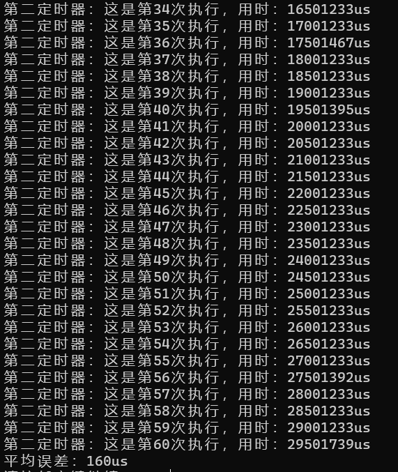
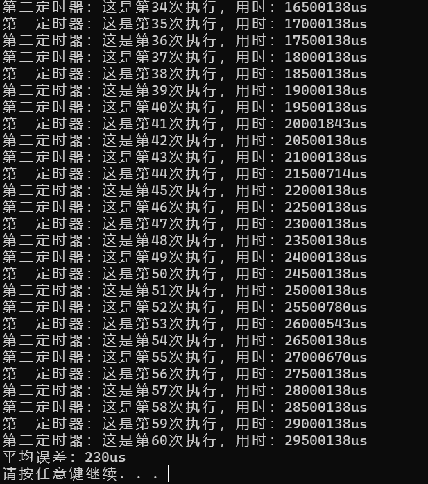
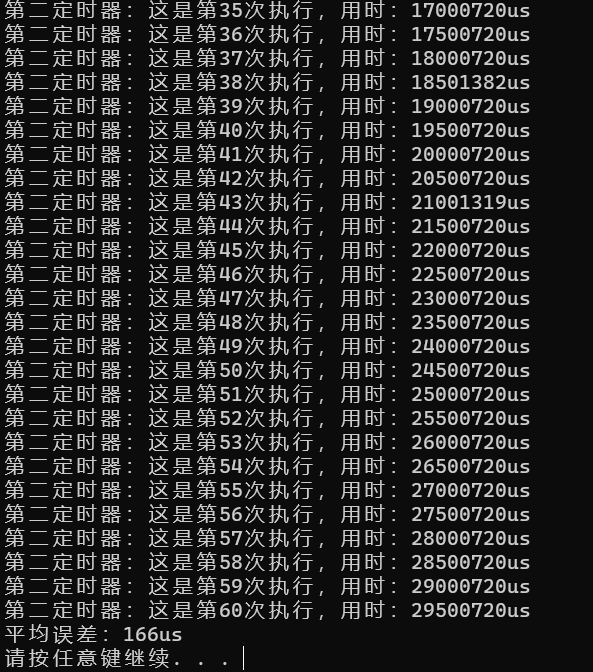

# 基于QueryPerformanceCounter的高精度定时器

**本定时器采用原生WIN32 API，C++代码实现。平均误差在185微秒**

### 详情介绍：  
本项目通过WIN32 API中的QueryPerformanceCounter函数实现一中高精度的循环
定时器，使用者可以通过它来等时间间距执行代码，并设置结束循环定时的时
间，超时结束时会执行超时结束函数，可自行设置。 
 
也可以手动停止，手动停止不会执行超时结束函数。  

经过实验，每个间距的平均误差为185微秒，且不会累计误差。  

本代码使用**vs2019**编写


### 所需头文件：  
`#include <iostream>`  
`#include <windows.h>`

### 定义文件：  
`HighPrecisionTimer.h`

### 实现文件：  
`HighPrecisionTimer.cpp`

### 测试代码:  
在HighPrecisionTimer.cpp文件中
```c++
/*测试程序，打包库时请注释掉*/
/*测试用的全局变量*/
LARGE_INTEGER __tmp;
LARGE_INTEGER __start;
LARGE_INTEGER __end;
int num = 0;
int num2 = 0;
long long accurate = 0;//准确
long long error = 0;//误差
/*测试用的第一定时器执行函数*/
void proc()
{
	num++;
	QueryPerformanceCounter(&__end);
	std::cout << "第一定时器：这是第" << num << "次执行，用时：" << (__end.QuadPart - __start.QuadPart) / (__tmp.QuadPart/1000000) << "us\n";
}
/*测试用的第二定时器执行函数*/
void proc2()
{
	QueryPerformanceCounter(&__end);
	long long z = (__end.QuadPart - __start.QuadPart) / (__tmp.QuadPart / 1000000) - accurate;
	error += z>0?z: accurate- (__end.QuadPart - __start.QuadPart) / (__tmp.QuadPart / 1000000);
	accurate = (__end.QuadPart - __start.QuadPart) / (__tmp.QuadPart / 1000000) + 500000;
	num2++;
	std::cout << "第二定时器：这是第" << num2 << "次执行，用时：" << (__end.QuadPart - __start.QuadPart) / (__tmp.QuadPart / 1000000) << "us\n";
}
/*测试程序入口*/
int main()
{
	//因为测试程序在同一窗口打印文字，多个定时器同时开启时，会使打印的文字相互干扰，顺序混乱，但能看出两个定时器均正常运行
	std::cout << "开始\n";
	QueryPerformanceFrequency(&__tmp);
	QueryPerformanceCounter(&__start);
	HighPrecisionTimerClass _high_precision_timer(166666,30000000,proc,NULL,true);//166.666ms间隔,30s结束,开始执行
	HighPrecisionTimerClass _high_precision_timer2(500000, 30000000, proc2, NULL, true);//500.000ms间隔,30s结束,开始执行

	_high_precision_timer.Start_high_precision_timer(true);//开始定时器1
	_high_precision_timer2.Start_high_precision_timer(true);//开始定时器2

	Sleep(10000);
	_high_precision_timer.Stop_high_precision_timer();//手动关闭计时器1

	Sleep(30000);

	std::cout << "平均误差：" << error/60 << "us\n";
	system("pause");

	return 0;
}
```

### 测试结果:  
测试结果-1：  

测试结果-2：  

测试结果-3：  


### 留言:  
本人水平有限，如有不足，还请谅解
